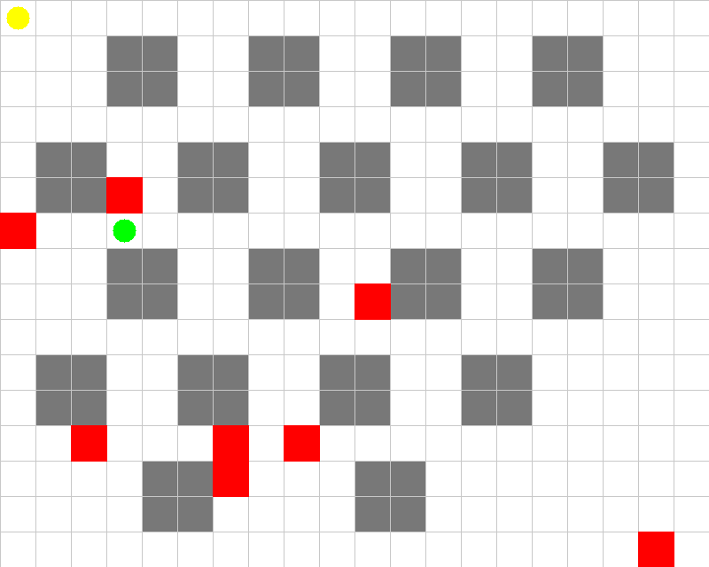

# Smart_Delivery_agent
An autonomous delivery agent framework trained using Reinforcement Learning (Q-Learning &amp; Double DQN) in a custom grid-world environment built with PyTorch
# 📦 Smart Autonomous Delivery Agent Framework

An autonomous delivery agent framework trained using **Reinforcement Learning (Q-Learning & Double DQN)** in a custom grid-world environment built with **PyTorch**. The agent learns optimal pathfinding and delivery strategies while avoiding dynamic obstacles and constraints.

---

## 🚀 Visualizing the Training

Here is a glimpse of the agent evaluating its pathfinding policy in the custom grid environment:



---

## ✨ Features

- **Custom Grid-World Environment**: A discrete delivery mapping space featuring static obstacles, compound constraints, and variable delivery targets.
- **Dual Algorithm Support**: 
  - **Classical Tabular Q-Learning**: For baseline testing and exact tabular state-space mapping.
  - **Deep Double DQN (DDQN)**: Leveraging a Convolutional Neural Network (CNN) to handle dense spatial feature maps via PyTorch.
- **Search-Based Baseline**: Included Breadth-First Search (BFS) pathfinding agent inside `test_agent.py` to compare classical shortest paths against RL agent rewards.
- **Reproducibility**: Global seed management for consistent environment initialization and weight metrics.
- **Automated Visualization**: Built-in wrappers to render episodes and export environment loops directly into `.gif` animations.

---

## 📂 Repository Structure

```bash
├── agents/
│   ├── Q_Learning_agent.py    # Tabular Q-Learning logic
│   └── double_dqn_agent.py    # Deep Double DQN architecture with Replay Buffer
├── env/
│   └── delivery_env.py        # Custom Grid-World environment implementation
├── models/
│   └── cnn_q_network.py       # PyTorch CNN model configuration
├── run_all.py                 # Pipeline to execute both Q-Learning and DDQN training
├── main.py                    # Script to test and evaluate BFS pathfinding performance
├── test_agent.py              # BFS baseline algorithm implementation
├── Figure_1.png               # Training analytics / performance graphs
└── q_learning_episode.gif     # Rendered evaluation simulation
